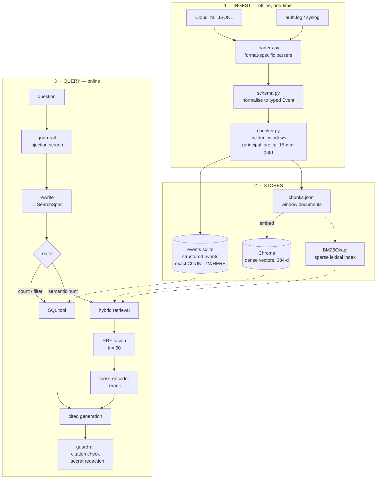
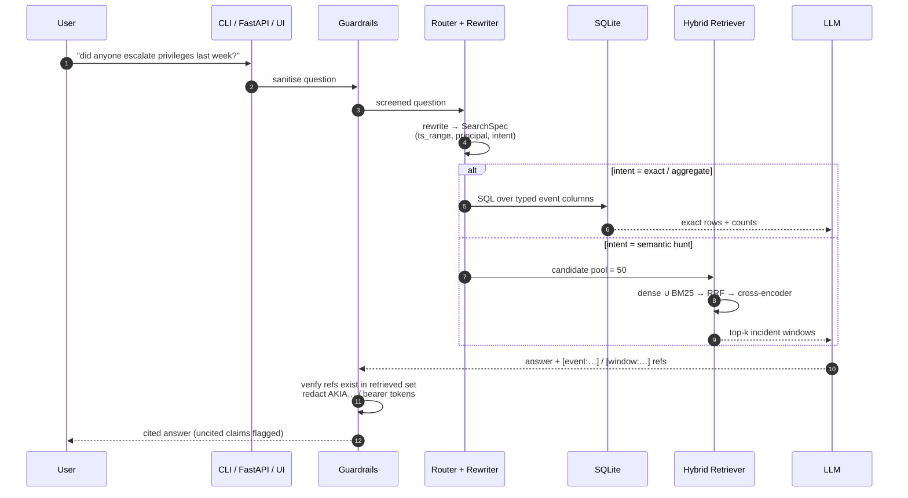

# slrag — RAG-Powered Security Log Analyzer

[](https://github.com/Manish93345/security-log-analyzer/actions/workflows/ci.yml)


Natural-language investigation over **AWS CloudTrail** and **Linux system logs**, with
**citation-backed answers** and a **measured** retrieval accuracy — built on
**free and local models only** (no paid API required).

```text
"did anyone escalate privileges last week?"
                    │
                    ├── guardrail   prompt-injection screen on retrieved log text
                    ├── rewrite     resolve time range + principal → SearchSpec
                    ├── route       exact/aggregate → SQL   |   semantic hunt → hybrid retrieval
                    ├── retrieve    dense (bge-small) + BM25 → RRF fusion → cross-encoder rerank
                    └── generate    answer carrying [event:ct-…] / [window:w-…] citations
```

---

## Table of contents

- [Why this design](#why-this-design)
- [Architecture](#architecture)
- [Request lifecycle](#request-lifecycle)
- [Features](#features)
- [Quick start](#quick-start)
- [Usage](#usage)
- [Configuration](#configuration)
- [Retrieval pipeline](#retrieval-pipeline)
- [Data & corpus](#data--corpus)
- [Results](#results)
- [Performance](#performance)
- [Guardrails & auditability](#guardrails--auditability)
- [Models used (all free)](#models-used-all-free)
- [Project layout](#project-layout)
- [Testing](#testing)
- [Documentation](#documentation)
- [License & citation](#license--citation)

---

## Why this design

Most "RAG over logs" projects embed raw log lines and hope similarity search answers
*"how many failed logins in the last 24h?"* — **it cannot.** Counting and filtering are exact
operations; a nearest-neighbour search is a probabilistic approximation of them, and that gap is
where those projects quietly produce wrong answers.

`slrag` splits the work by what each technique is actually good at:

| Question shape | Example | Path | Why |
|---|---|---|---|
| **Exact / aggregate** | "how many failed logins in the last 24h?" | **SQLite** | A count must be a count. Exact, auditable, milliseconds. |
| **Semantic / investigative** | "did anyone escalate privileges last week?" | **Hybrid retrieval** | The answer is spread across events that share no keywords. |
| **Both** | "show the suspicious activity around alice on Tuesday" | Router → retrieval + metadata filter | Narrow by time/principal, then rank by meaning. |

Three more decisions follow from the same principle:

- **Incident windows, not text splices.** Events are grouped into windows by
  `(principal, source_ip)` with a 15-minute inactivity gap, so a retrieved chunk is a coherent
  incident — not an arbitrary 512-token cut across unrelated days.
- **Every answer is cited.** The model must reference `[event:<id>]` / `[window:<id>]`, and a
  post-check verifies each reference exists in the retrieved set. An uncited answer is flagged,
  not trusted.
- **Log text is hostile input.** Retrieved log content is wrapped in `<log_data>` and screened
  for imperative phrases before it reaches the prompt, because **a log line is attacker-controlled
  text** — the classic prompt-injection vector in this domain.

---

## Architecture



---

## Request lifecycle



---

## Features

| | Feature |
|---|---|
| **Ingest** | CloudTrail JSON (nested `userIdentity` / `requestParameters` / `responseElements`) and syslog-family parsers; malformed lines are counted and tolerated, never fatal |
| **Normalisation** | One typed `Event` schema across every source; deterministic IDs (`ct-<eventID>`, `sl-<sha1[:12]>`) |
| **Windowing** | Incident windows by `(principal, source_ip)` with a 15-minute gap and a token cap — coherent context instead of arbitrary splices |
| **Dual store** | SQLite for exact/aggregate queries, Chroma for semantic search — each used for what it is good at |
| **Hybrid retrieval** | Dense + BM25 candidates fused with Reciprocal Rank Fusion, then a cross-encoder rerank |
| **Resumable indexing** | Re-running the index skips windows already stored; a killed run costs seconds, not hours |
| **Citations** | Every claim traceable to `[event:<id>]` / `[window:<id>]`, verified against the retrieved set |
| **Guardrails** | Prompt-injection screen, poisoned-log flagging, citation enforcement, secret redaction, 429 retry with backoff |
| **Three surfaces** | CLI, REST API (FastAPI), web UI (Streamlit) over one core |
| **Free by default** | Local ONNX embeddings + reranker; free-tier or local LLM. No credit card, no billing |

---

## Quick start

### Windows (PowerShell)

```powershell
git clone https://github.com/Manish93345/security-log-analyzer.git
cd security-log-analyzer
python -m venv .venv
.venv\Scripts\Activate.ps1
python -m pip install -r requirements.txt
Copy-Item .env.example .env      # then paste your free API keys
python scripts/tasks.py doctor
```

### Linux / macOS

```bash
git clone https://github.com/Manish93345/security-log-analyzer.git
cd security-log-analyzer
python -m venv .venv && source .venv/bin/activate
make bootstrap
cp .env.example .env             # then paste your free API keys
make doctor
```

### Build the corpus and ask something

```bash
python scripts/generate_logs.py --full          # ≈224,000 records  → data/raw/
python scripts/tasks.py ingest                  # → data/processed/events.sqlite + chunks.jsonl
python scripts/tasks.py index                   # → data/chroma/   (resumable)
python scripts/tasks.py ask "did anyone escalate privileges last week?"
```

Serve it:

```bash
python scripts/tasks.py api                     # FastAPI   → http://localhost:8000/docs
python scripts/tasks.py ui                      # Streamlit → http://localhost:8501
```

> **Note:** `scripts/tasks.py` is the cross-platform task runner (Windows has no `make`).
> The equivalent `make` targets exist for Linux/macOS.

---

## Usage

### CLI

| Command | Purpose |
|---|---|
| `slrag ingest` | Parse raw logs → normalised events + incident windows |
| `slrag stats` | Corpus composition, severity histogram, window counts |
| `slrag index` | Embed windows into Chroma + build the BM25 index |
| `slrag search "<query>"` | Hybrid retrieval, prints ranked windows with scores and provenance |
| `slrag ask "<question>"` | Full agent: rewrite → route → retrieve → cited answer |
| `slrag version` | Version + resolved config summary |

Useful flags:

```bash
slrag index  --check                  # report index completeness without rebuilding
slrag index  --no-resume              # force a clean rebuild
slrag index  --limit 500              # build a small index for a fast smoke test
slrag search "brute force ssh" -k 5 --no-rerank
```

### Task runner

```bash
python scripts/tasks.py doctor          # environment + dependency check
python scripts/tasks.py ingest
python scripts/tasks.py index
python scripts/tasks.py search "failed sudo commands on the web server"
python scripts/tasks.py git-phase --phase 3 --slug retrieval
```

### REST API

```bash
curl -X POST localhost:8000/ask \
     -H 'Content-Type: application/json' \
     -d '{"question":"did anyone escalate privileges last week?"}'
```

| Route | Method | Purpose |
|---|---|---|
| `/health` | GET | Liveness + index readiness |
| `/ask` | POST | Cited natural-language answer |
| `/search` | POST | Raw hybrid-retrieval results |
| `/events/{id}` | GET | Single normalised event |
| `/ingest` | POST | Trigger/refresh ingest |
| `/metrics` | GET | Latency and retrieval counters |

---

## Configuration

All settings come from `.env` (see `.env.example`); the code reads them through
`src/slrag/config.py`, so nothing is hard-coded.

| Variable | Default | Meaning |
|---|---|---|
| `LLM_PROVIDER` | `groq` | `groq` \| `gemini` \| `ollama` \| `openai` |
| `GROQ_API_KEY` | — | Free key — <https://console.groq.com/keys> |
| `GOOGLE_API_KEY` | — | Optional free key — <https://aistudio.google.com/app/apikey> |
| `EMBEDDING_MODEL` | `BAAI/bge-small-en-v1.5` | Local ONNX embedding model (384-d) |
| `EMBEDDING_DEVICE` | `auto` | `auto` \| `cpu` \| `cuda` (CUDA needs `onnxruntime-gpu`) |
| `EMBEDDING_BATCH_SIZE` | `64` | Embedding batch size |
| `INDEX_BATCH_SIZE` | `256` | Chroma write batch size |
| `INDEX_RESUME` | `true` | Skip windows already in the collection |
| `CHROMA_DIR` | `data/chroma` | Persistent vector store path |
| `RETRIEVE_TOP_K` | `5` | Windows returned to the LLM |
| `CANDIDATE_POOL` | `50` | Candidates entering the reranker |
| `RRF_K` | `60` | Reciprocal Rank Fusion constant |
| `BM25_K1` / `BM25_B` | `1.5` / `0.75` | BM25 term-frequency / length normalisation |
| `RERANK_ENABLED` | `true` | Cross-encoder rerank toggle |
| `RERANK_MODEL` | `ms-marco-MiniLM-L-6-v2` | ONNX cross-encoder |

---

## Retrieval pipeline

```text
question
   │
   ├─ [1] metadata pre-filter   ts_range · principal · source_ip · event_name  → Chroma `where`
   │
   ├─ [2] candidate generation
   │        dense   : bge-small-en-v1.5 (384-d)  ─┐
   │        sparse  : BM25Okapi over search_text  ─┤  each returns its own ranking
   │
   ├─ [3] fusion      Reciprocal Rank Fusion (k=60) — rank-based, so the two
   │                  scorers never need comparable scales
   │
   ├─ [4] rerank      ONNX cross-encoder over the top-50 → top-k
   │
   └─ [5] generate    cited answer + citation verification
```

| Stage | Technique | Why it earns its place |
|---|---|---|
| Normalisation | Typed `Event` + structured columns | Makes exact filters possible at all |
| Routing | Intent classifier → SQL vs retrieval | Removes an entire class of wrong answers |
| Rewriting | "last 24h", ARNs, usernames → `SearchSpec` | Large win on time-scoped questions |
| Hybrid | Dense + BM25 → RRF | Recovers exact identifiers (`0.0.0.0/0`, `StopLogging`) that embeddings blur |
| Pre-filter | Chroma `where` pushdown | Kills cross-time false positives before ranking |
| Rerank | Cross-encoder, pool 50 | Highest accuracy gain per CPU-second in the pipeline |
| Windowing | Incident windows | Context a model can actually reason over |

**Why RRF and not score averaging:** dense cosine similarities and BM25 scores are not on a
common scale, and BM25 is unbounded. Fusing by *rank* sidesteps calibration entirely and is
robust when one retriever is much stronger on a given query.

---

## Data & corpus

The corpus is **hybrid**, because no single source gives volume, realism *and* ground truth:

| Source | Volume | Role |
|---|---|---|
| Synthetic CloudTrail (JSONL) | 123,414 events | **Labelled** attack scenarios — the ground truth |
| Synthetic `auth.log` | 80,851 lines | sshd, sudo, su, cron |
| Synthetic `syslog` | 20,010 lines | kernel, systemd |
| **Total ingested** | **224,275 records** | exceeds the 100K+ target with headroom |
| Loghub (optional) | Linux, OpenSSH, Apache, Zookeeper, Mac | Real-world formatting quirks — <https://github.com/logpai/loghub> |

**Ten planted attack scenarios**, each with ground-truth event IDs written to
`data/eval/labels.json`:

| ID | Scenario | Planted signature |
|---|---|---|
| S1 | Console brute force | 200+ `ConsoleLogin` failures from one IP, then success |
| S2 | SSH brute force | 400+ `Failed password`, then `Accepted password` |
| S3 | IAM privilege escalation | `CreateUser` → `AttachUserPolicy(AdministratorAccess)` → `CreateAccessKey` |
| S4 | S3 bucket made public | `PutBucketPolicy` `Principal: "*"` + `PutBucketAcl public-read` |
| S5 | Security group opened to the world | `AuthorizeSecurityGroupIngress` `0.0.0.0/0` on 22/3389 |
| S6 | Logging tampering | `StopLogging` / `DeleteTrail` on the audit trail |
| S7 | Root account usage | `ConsoleLogin` as `Root` from an unusual ASN |
| S8 | Credential stuffing | Many `AssumeRole` / `GetCallerIdentity` failures across users |
| S9 | Impossible travel | Same user, two continents, 12 minutes apart |
| S10 | Data exfiltration pattern | 3,000 `GetObject` on one bucket in 20 minutes |

**This is the unlock:** because the attacks are *planted*, the correct answer set is known, so
Recall@k and MRR are measured against real ground truth rather than intuition. Loghub has no
CloudTrail dataset — which is exactly why the synthetic CloudTrail generator exists, with full
fidelity to the nested JSON structure a security RAG has to handle.

Full composition and licensing: [`docs/DATA.md`](docs/DATA.md).

---

## Results

### Corpus & ingest — measured

| Metric | Value |
|---|---|
| Records ingested | **224,275** |
| Malformed lines skipped | 0 |
| Incident windows produced | **38,767** |
| Failure / authz-denied events | 27,676 (12.3%) |
| High-risk windows (severity ≥ 50) | 333 |
| Ingest wall time | 20.5 s |
| `events.sqlite` size | 352.9 MB |
| Embedding dimension | 384 |
| Windows indexed into Chroma | **38,767** |

### Retrieval accuracy

Scored by `python -m slrag.eval.run_eval` on the curated eval set, against the planted
scenario labels.

| Metric | Value |
|---|---|
| Recall@1 | _pending Phase 5_ |
| **Recall@3** | _pending Phase 5_ |
| Recall@5 | _pending Phase 5_ |
| MRR@10 | _pending Phase 5_ |
| Citation precision | _pending Phase 5_ |

> **Why these are blank.** This project follows one rule: **we never publish a metric we did not
> measure.** The eval harness is the only thing permitted to write these numbers, and it has not
> been run against the final retriever yet. Every other figure in this README is a real
> measurement from a real run on a 224,275-record corpus. Filling these cells with a plausible
> number would invalidate the whole point of building a labelled corpus.

---

## Performance

Index build on a laptop CPU, measured end to end:

| Phase | Rate | Share of total |
|---|---|---|
| Embedding (ONNX, `bge-small-en-v1.5`) | 5.6 – 7.0 windows/s | **~100%** |
| Chroma write (SQLite + HNSW) | ~1,050 windows/s | ~0% |
| **Combined** | **~7 windows/s** | full corpus ≈ 90 min |

That split is the useful engineering result: **the transformer forward pass is the entire cost**,
and the vector-store write is effectively free. It is why the index is resumable by default — a
rebuild interrupted at 99% costs seconds to finish, not hours — and why swapping in a GPU
(`EMBEDDING_DEVICE=cuda` with `onnxruntime-gpu`) is the only lever with real headroom.

```bash
python scripts/bench_embed.py --limit 200            # measure the split yourself
python scripts/bench_embed.py --limit 500 --device cuda
```

Windows in this corpus average **1,240 characters** (max 4,943) — comfortably inside the
embedding model's 512-token window, so no window text is silently truncated.

---

## Guardrails & auditability

| Guardrail | Implementation | Test |
|---|---|---|
| Prompt-injection screen | Regex + heuristic scoring on retrieved log text; log content wrapped in `<log_data>`; system prompt forbids following instructions found inside it | `test_injection_phrases_blocked` |
| Poisoned-log detection | Flags chunks containing imperatives ("ignore previous", "you are now", "system:") and warns instead of obeying | `test_poisoned_log_flagged` |
| Citation enforcement | Answer must contain `[event:<id>]` / `[window:<id>]`; each ref is verified against the retrieved set; uncited claims are flagged | `test_uncited_answer_flagged` |
| Secret redaction | Masks AWS access keys (`AKIA…`), bearer tokens, passwords in output | `test_secret_redaction` |
| Rate-limit guard | Per-request token budget + provider retry with backoff (free tiers are rate-limited) | `test_retry_on_429` |

Treating log content as untrusted input is not decorative here: a log line can be written by an
attacker (a user-agent string, a crafted filename, an SSH username), and retrieved text flows
straight into the prompt. The injection screen exists because that is a realistic attack on this
specific system.

---

## Models used (all free)

| Role | Default | Alternatives |
|---|---|---|
| **Generation** | Groq `openai/gpt-oss-120b` (free tier) | Gemini 3.5 Flash free tier · Ollama local · OpenRouter `:free` |
| **Embeddings** | `BAAI/bge-small-en-v1.5` via **fastembed** — ONNX, 384-d, no torch | `bge-base-en-v1.5` (768-d) · OpenAI `text-embedding-3-small` (paid) |
| **Reranker** | ONNX cross-encoder `ms-marco-MiniLM-L-6-v2` | `bge-reranker-base` |
| **Vector store** | Chroma (persistent, local) | FAISS · Qdrant |
| **Structured store** | SQLite (stdlib) | DuckDB |

The provider layer is OpenAI-SDK compatible, so switching to a paid provider later is a single
`.env` change (`LLM_PROVIDER=openai`). **Privacy note:** Groq's free tier does not train on your
data; Google's free tier may. For a log analyzer the default is therefore Groq — and Ollama
(`llama3.1:8b`) gives a fully offline fallback that works with the network off.

---

## Project layout

```text
src/slrag/
  config.py          env-driven settings, no hard-coded constants
  cli.py             ingest · stats · index · search · ask · version
  logging_setup.py   structured logging
  providers/         llm.py (Groq/Gemini/Ollama/OpenAI) · embeddings.py (fastembed)
  ingest/            schema.py · loaders.py · chunker.py · store.py · pipeline.py
  retrieval/         vector_store.py · bm25.py · fusion.py · rerank.py · indexer.py · pipeline.py
  agent/             tools.py · pipeline.py · prompts.py
  guardrails/        injection.py · redaction.py · citations.py
  eval/              build_eval_set.py · run_eval.py
  api/               main.py · schemas.py
  ui/                app.py
scripts/
  generate_logs.py   deterministic synthetic CloudTrail + auth.log/syslog corpus
  download_loghub.sh real public log datasets (optional)
  tasks.py           cross-platform task runner
  bench_embed.py     isolates embedding cost vs vector-store write cost
tests/               unit · integration · contract tests
docs/                BLUEPRINT · HANDOFF · DATA · SETUP-WINDOWS · TESTING
```

---

## Testing

```bash
python scripts/tasks.py test          # or: make test
ruff check .                          # or: make lint
pytest -m integration                 # ingest → Chroma → retrieve on a small fixture
python -m slrag.eval.run_eval         # accuracy harness (needs an LLM key)
```

| Level | Scope | Runs in CI |
|---|---|---|
| Unit | Parsers, chunker, BM25, RRF fusion, rerank, guardrails, tools | Yes |
| Integration | ingest → Chroma → retrieve on a fixture corpus | Yes (local embeddings, no API) |
| Contract | Every API route + schema, LLM mocked | Yes |
| Eval | Recall@1/3/5, MRR, citation precision | No — run locally |
| Manual | Streamlit click-through, `docker compose up` | No |

**Current state:** `ruff` clean, **158 tests passing**. Every test is deterministic — fixed seeds
and an injectable clock, no paid key required. `pytest -m "not integration"` runs in under a
minute.

---

## Documentation

| Doc | Contents |
|---|---|
| [`docs/BLUEPRINT.md`](docs/BLUEPRINT.md) | Full architecture, phase plan, accuracy strategy, risk register |
| [`docs/HANDOFF.md`](docs/HANDOFF.md) | Living handoff: current state, next actions, resume prompt |
| [`docs/DATA.md`](docs/DATA.md) | Corpus composition, scenario labels, licensing |
| [`docs/SETUP-WINDOWS.md`](docs/SETUP-WINDOWS.md) | Step-by-step Windows setup walkthrough |

---

## License & citation

**Code:** MIT.

**Loghub datasets** (optional) are free for research or academic use. If you use them, cite:

> Jieming Zhu, Shilin He, Pinjia He, Jinyang Liu, Michael R. Lyu.
> *Loghub: A Large Collection of System Log Datasets for AI-driven Log Analytics.* ISSRE 2023.
> <https://github.com/logpai/loghub>
